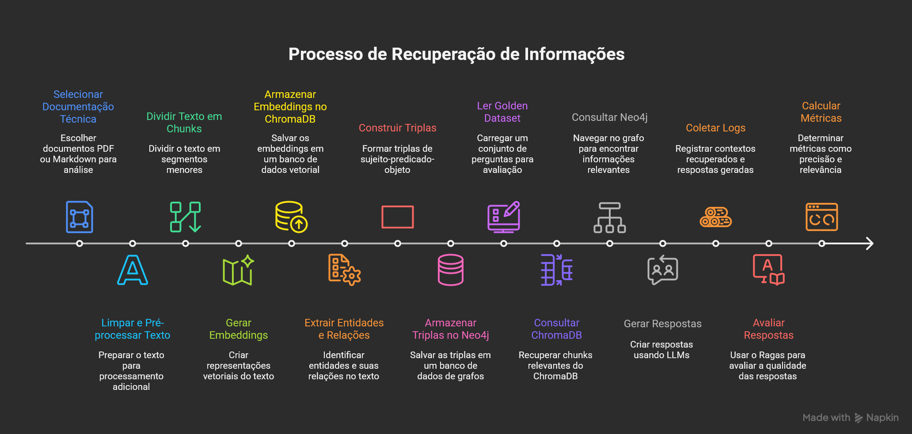

# Plano de Experimento – Scoping e Planejamento

## 1. Identificação básica

**1.1 Título do experimento**
Análise Comparativa de Eficácia entre *Vector RAG* e *GraphRAG* na Resolução de Consultas *Multi-hop* em Documentação de Software.

**1.2 ID / código**
EXP-TCC-RAG-01

**1.3 Versão do documento e histórico de revisão**
* **v0.1:** Criação inicial do esboço e definição de escopo (25/11/2025).
* **v0.2:** Revisão detalhada do GQM e métricas quantitativas.

**1.4 Datas (criação, última atualização)**
* **Criação:** 25/11/2025
* **Última Atualização:** 25/11/2025

**1.5 Autores (nome, área, contato)**
* **Autor Principal:** Carlos Henrique Neimar Areas Ferreira (Engenharia de Software)
* **Contato:** carlos.areas@sga.pucminas.br

**1.6 Responsável principal (PI / dono do experimento)**
Carlos Henrique Neimar Areas Ferreira

**1.7 Projeto / produto / iniciativa relacionada**
Proposta de Experimento para TCC – Medição e Experimentação em Engenharia de Software.

---

## 2. Contexto e problema

**2.1 Descrição do problema / oportunidade**
Modelos de RAG baseados apenas em vetores (similaridade semântica) apresentam degradação de performance em consultas que exigem raciocínio complexo (*multi-hop reasoning*), onde a resposta depende da conexão de informações dispersas em diferentes partes da documentação. A oportunidade reside em verificar se a estruturação dos dados em Grafos de Conhecimento (*GraphRAG*) resolve essa limitação ao explicitar relacionamentos entre entidades.

**2.2 Contexto organizacional e técnico**
* **Ambiente:** Acadêmico.
* **Domínio:** Documentação Técnica de Software (APIs, Frameworks, Arquitetura).
* **Stack Tecnológico:** Python, LlamaIndex (Orquestração), Neo4j (Grafo), ChromaDB (Vetorial), OpenAI GPT-4o-mini (LLM de extração/geração) e Ragas (Framework de avaliação).

**2.3 Trabalhos e evidências prévias**
**Externos:**
* "Retrieval-Augmented Generation for Knowledge-Intensive NLP Tasks" (Lewis et al., 2020).
* "From Local to Global: A Graph RAG Approach" (Edge et al., Microsoft, 2024).
* "Searching for Best Practices in Retrieval-Augmented Generation" (Xiaohua Wan, 2024).

**2.4 Referencial teórico e empírico essencial**
* Conceitos de *Embedding Spaces* e *Dense Retrieval*.
* Teoria dos Grafos (Nós, Arestas, Triplas RDF).
* Métricas de Avaliação de LLMs: *Faithfulness*, *Answer Relevance*, *Context Precision*.

---

## 3. Objetivos e questões (Goal / Question / Metric)

**3.1 Objetivo geral**
Analisar as arquiteturas de *Vector RAG* e *GraphRAG* com o propósito de comparar a eficácia na recuperação de informação e eficiência operacional com respeito a consultas de raciocínio *multi-hop* do ponto de vista de desenvolvedores de software no contexto de documentação técnica.

**3.2 Objetivos específicos (OE)**
1.  **OE1 (Baseline):** Avaliar a eficiência operacional e a capacidade de recuperação direta do pipeline *Vector RAG* (Baseline).
2.  **OE2 (Desafiante):** Avaliar a complexidade estrutural, custo de construção e impacto na latência do pipeline *GraphRAG*.
3.  **OE3 (Dataset):** Validar a qualidade e a complexidade do *Golden Dataset* gerado para garantir que ele represente adequadamente desafios *multi-hop*.
4.  **OE4 (Comparação de Qualidade):** Comparar a qualidade semântica e a fidelidade das respostas geradas pelas duas abordagens.

### 3.3 Tabela GQM (Goal-Question-Metric)

| Objetivo Específico | Questão de Pesquisa (Q) | Métricas Associadas (M) |
| :--- | :--- | :--- |
| **OE1: Vector Baseline** | **Q1.1:** O processo de ingestão vetorial é eficiente (tempo/espaço)? | 1. Tempo de Ingestão (T_Ingest) 2. Tamanho do Índice (S_Index) |
| | **Q1.2:** A recuperação simples (single-hop) é eficaz? | 3. Hit Rate @ K (HR@k) 4. Mean Reciprocal Rank (MRR) |
| | **Q1.3:** Qual a latência base do sistema vetorial? | 5. Latência de Recuperação (L_Ret) 6. Throughput (QPS) |
| **OE2: Graph Challenger** | **Q2.1:** Qual o custo financeiro/computacional de construção do grafo? | 7. Custo de Extração (C_Extract) 8. Tokens de Ingestão (Tok_Ingest) |
| | **Q2.2:** O grafo é estruturalmente denso o suficiente para conexões? | 9. Densidade do Grafo (G_Dens) 10. Grau Médio (Avg_Deg) |
| | **Q2.3:** A travessia do grafo penaliza a latência excessivamente? | 5. Latência de Recuperação (L_Ret) 11. Tempo de Geração (T_Gen) |
| **OE3: Dataset Quality** | **Q3.1:** O dataset possui complexidade *multi-hop* real? | 12. Média de Hops (Avg_Hops) 13. Proporção Multi-hop (Prop_MH) |
| | **Q3.2:** O *Ground Truth* é bem fundamentado no texto? | 14. Tamanho Contexto Ref. (Len_GT) 15. Cobertura Chave (Key_Cov) |
| | **Q3.3:** Há diversidade de tópicos cobertos? | 16. Distribuição Tópicos (Topic_Dist) 17. Entropia Vocabulário (Vocab_Ent) |
| **OE4: Qualidade Final** | **Q4.1:** O *GraphRAG* reduz o ruído no contexto recuperado? | 18. Context Precision (C_Prec) 19. Noise Rate (N_Rate) |
| | **Q4.2:** A resposta gerada é fiel e livre de alucinações? | 20. Faithfulness (Faith) 21. Answer Relevance (Ans_Rel) |
| | **Q4.3:** A resposta é semanticamente correta frente ao gabarito? | 22. BERTScore (Sem_Sim) 23. Answer Correctness (Ans_Corr) |

### 3.4 Dicionário de Métricas

| ID | Métrica | Descrição | Unidade |
| :--- | :--- | :--- | :--- |
| **M01** | **Context Precision** | Proporção de trechos relevantes recuperados que estão no topo do ranking (Ragas). | Escala [0.0 - 1.0] |
| **M02** | **Faithfulness** | Consistência factual da resposta em relação ao contexto (Ragas). | Escala [0.0 - 1.0] |
| **M03** | **Answer Relevance** | Pertinência da resposta em relação à pergunta (Ragas). | Escala [0.0 - 1.0] |
| **M04** | **BERTScore** | Similaridade semântica entre resposta gerada e *Ground Truth*. | Escala [0.0 - 1.0] |
| **M05** | **Hit Rate @ K** | % de vezes que o doc correto aparece nos top-K resultados. | Porcentagem (%) |
| **M06** | **Latência de Recuperação** | Tempo entre envio da query e retorno dos chunks (antes da geração). | Segundos (s) |
| **M07** | **Tempo de Ingestão** | Tempo total para processar documentos e construir índice. | Minutos (min) |
| **M08** | **Custo de Extração** | Custo estimado (API OpenAI) para processamento. | Dólar ($) |
| **M09** | **Densidade do Grafo** | Razão entre arestas existentes e arestas possíveis. | Razão (Adimensional) |
| **M10** | **Grau Médio dos Nós** | Média de conexões por entidade no grafo. | Número Real |
| **M11** | **Answer Correctness** | Precisão combinada (semântica + factual) via Ragas. | Escala [0.0 - 1.0] |
| **M12** | **Tamanho do Índice** | Espaço em disco ocupado (ChromaDB ou Neo4j). | Megabytes (MB) |
| **M13** | **Noise Rate** | Proporção de sentenças irrelevantes no contexto recuperado. | Porcentagem (%) |

---

## 4. Escopo e contexto do experimento

**4.1 Escopo funcional**
* **Incluído:**
    * Ingestão de 1 documentação técnica completa.
    * Desenvolvimento de scripts Python para os dois pipelines.
    * Criação de 30-50 pares de Pergunta/Resposta (Golden Set).
    * Avaliação automatizada "LLM-as-a-Judge".
* **Excluído:**
    * Desenvolvimento de Interface Gráfica (Frontend).
    * *Fine-tuning* dos modelos de LLM.
    * Avaliação massiva com usuários humanos.

**4.2 Contexto do estudo**
Experimento controlado (*in silico*), utilizando datasets estáticos e avaliadores baseados em IA, simulando um cenário real de busca em documentação corporativa.

**4.3 Premissas**
* Disponibilidade da API da OpenAI durante o período de testes.
* A documentação escolhida possui estrutura lógica suficiente (referências cruzadas) para justificar o uso de grafos.

**4.4 Restrições**
* **Orçamento:** Limitado a créditos de API.
* **Hardware:** Processamento local.

**4.5 Limitações previstas**
* Dependência da qualidade do modelo extrator (LLM) para criar o grafo.
* Generalização limitada ao tipo de documentação técnica escolhida.

---

## 5. Stakeholders e impacto esperado

**5.1 Stakeholders principais**
* **Desenvolvedores:** Interessados na implementação técnica e reprodução.
* **Gestores/Academia:** Interessados no *trade-off* de custo/benefício.

**5.2 Interesses e expectativas**
* **Desenvolvedores:** Método científico claro e reprodutível.
* **Gestores:** Resultados objetivos para tomada de decisão arquitetural.

**5.3 Impactos potenciais**
* Consumo de recursos de API durante a execução.
* Influência na arquitetura de sistemas de busca corporativa (decisão entre RAG simples vs. complexo).

---

## 6. Riscos de alto nível, premissas e critérios de sucesso

**6.1 Riscos de alto nível**
* **Técnico:** Dificuldade em definir uma Ontologia eficiente, gerando grafos desconexos.
* **Financeiro:** Estouro do orçamento de API na fase de extração do GraphRAG.
* **Ferramental:** Incompatibilidade nas bibliotecas (LlamaIndex/LangChain).

**6.2 Critérios de sucesso globais (Go / No-Go)**
* Execução completa do benchmark.
* Diferença estatística ou observável nas métricas do Ragas entre os pipelines.
* *Go:* Pipelines funcionais e Golden Dataset criado.

**6.3 Critérios de parada antecipada**
* Custo de ingestão projetado superior ao orçamento nos primeiros 10% dos dados.
* Falha da LLM em extrair triplas coerentes (necessidade de troca de dataset).

## 7. Modelo conceitual e hipóteses

**7.1 Modelo conceitual do experimento**
O modelo baseia-se na premissa de que a **Recuperação Vetorial (Vector RAG)** opera por similaridade semântica em um espaço denso. Embora eficaz para correspondências diretas, este modelo tende a falhar em "saltos lógicos", pois a similaridade vetorial entre a *Pergunta* e o *Documento B* (que contém a resposta final) pode ser baixa se a conexão depender de um *Documento A* intermediário.

Em contraste, o **GraphRAG** modela explicitamente as dependências (A → B) como arestas. O modelo conceitual propõe que a **Estrutura de Grafo** atua como um mecanismo de "inferência guiada", permitindo que o sistema recupere contextos que são semanticamente distantes, mas topologicamente vizinhos.

Espera-se que:
1.  Nas consultas **Single-hop**, a técnica vetorial seja suficiente e mais eficiente (menor latência/custo).
2.  Nas consultas **Multi-hop**, a técnica vetorial sofra degradação de *Recall* e *Precision*, enquanto o grafo manterá a consistência ao "caminhar" pelas relações.

**7.2 Hipóteses formais (H0, H1)**

Para validar o Objetivo Específico 4 (Comparação de Qualidade), formulam-se as seguintes hipóteses estatísticas:

* **H1 (Context Precision em Multi-hop):**
    * $H0_{1}$: Não há diferença significativa na precisão do contexto (*Context Precision*) entre Vector RAG e GraphRAG para consultas multi-hop ($\mu_{vector} = \mu_{graph}$).
    * $H1_{1}$: O GraphRAG apresenta maior precisão de contexto do que o Vector RAG em consultas multi-hop ($\mu_{graph} > \mu_{vector}$).

* **H2 (Fidelidade/Alucinação):**
    * $H0_{2}$: Não há diferença significativa na métrica de fidelidade (*Faithfulness*) entre as respostas geradas pelas duas abordagens.
    * $H1_{2}$: O GraphRAG gera respostas com maior fidelidade (menos alucinações) devido à restrição imposta pelas relações do grafo.

* **H3 (Custo de Ingestão - Trade-off):**
    * $H0_{3}$: O custo de construção dos índices é equivalente.
    * $H1_{3}$: O custo de construção do GraphRAG é significativamente superior ao do Vector RAG (validando a premissa de *trade-off* custo/qualidade).

**7.3 Nível de significância e considerações de poder**
Será adotado um nível de significância de **$\alpha = 0,05$** (95% de confiança).
Dado que o tamanho da amostra (*Golden Dataset*) é limitado (30 a 50 pares de perguntas), o poder estatístico (*statistical power*) pode ser reduzido para detectar efeitos pequenos. Portanto, a análise focará também no **tamanho do efeito (Effect Size)** (ex: d de Cohen) e na análise qualitativa dos casos onde houve divergência entre os modelos, caracterizando um estudo misto (quantitativo-qualitativo).

---

## 8. Variáveis, fatores, tratamentos e objetos de estudo

**8.1 Objetos de estudo**
Os objetos de estudo são os **fragmentos de documentação técnica** (chunks e nós de grafo) e as **consultas de teste** (queries) submetidas aos sistemas. A documentação selecionada será de um framework *Open Source* moderno (ex: FastAPI ou LangChain), garantindo complexidade real.

**8.2 Sujeitos / participantes (visão geral)**
Como este é um experimento *in silico* (automatizado), não haverá participantes humanos diretos na fase de execução.
* **Avaliador:** O papel de "juiz" será desempenhado por uma LLM (GPT-4o) configurada via framework *Ragas* para simular a percepção humana de relevância e fidelidade.
* **Oráculo:** O *Golden Dataset* (gabarito) será curado pelo autor do trabalho (humano) para garantir a veracidade do *Ground Truth*.

**8.3 Variáveis independentes (fatores) e seus níveis**
O experimento manipula dois fatores principais:
1.  **Arquitetura de Recuperação:** Com dois níveis (Vector vs. Graph).
2.  **Complexidade da Pergunta:** Com dois níveis (Single-hop vs. Multi-hop).

**8.4 Tratamentos (condições experimentais)**
O cruzamento dos fatores resulta em 4 tratamentos experimentais, conforme detalhado na Tabela 2 abaixo.

**8.5 Variáveis dependentes (respostas)**
As variáveis dependentes são as métricas de qualidade e eficiência coletadas a partir do framework *Ragas* e logs de execução (ex: *Context Precision*, *Faithfulness*, Latência, Custo).

**8.6 Variáveis de controle / bloqueio**
Para evitar viés, as seguintes variáveis serão mantidas constantes:
* **Modelo de LLM (Gerador):** O mesmo modelo (GPT-4o-mini) será usado para gerar respostas em ambos os pipelines.
* **Temperatura:** Fixada em 0.0 para garantir determinismo.
* **Dataset:** Ambos os pipelines consumirão exatamente a mesma documentação fonte.
* **Tamanho do Chunk:** O tamanho base para vetorização será padronizado (ex: 512 tokens).

**8.7 Possíveis variáveis de confusão conhecidas**
* **Qualidade do Prompt:** A forma como o prompt é construído pode favorecer um modelo. Será utilizado um prompt genérico e neutro para a etapa de resposta.
* **Erros de Extração:** No GraphRAG, falhas da LLM em identificar entidades durante a ingestão podem ser confundidas com falha da arquitetura do grafo.

### Tabelas de Definição Experimental

#### Tabela 1: Variáveis do Experimento

| Tipo | Variável | Descrição Operacional | Escala/Unidade |
| :--- | :--- | :--- | :--- |
| **Independente** | Arquitetura RAG | O método utilizado para recuperar contexto. | Nominal {Vector, Graph} |
| **Independente** | Complexidade da Query | O nível de raciocínio necessário para responder. | Nominal {Single-hop, Multi-hop} |
| **Dependente** | Context Precision | Medida de quão relevante é o contexto recuperado (M01). | Razão [0.0 - 1.0] |
| **Dependente** | Faithfulness | Medida de ausência de alucinação na resposta (M02). | Razão [0.0 - 1.0] |
| **Dependente** | Latência Total | Tempo decorrido do envio da query à resposta final (M06 + M11). | Contínua (Segundos) |
| **Dependente** | Custo de Ingestão | Custo financeiro para processar a documentação (M08). | Contínua (USD) |
| **Controle** | Modelo LLM | Modelo de linguagem usado para geração. | Constante (GPT-4o-mini) |
| **Controle** | Temperatura | Parâmetro de aleatoriedade do modelo. | Constante (0.0) |

#### Tabela 2: Fatores, Tratamentos e Combinações

| ID Tratamento | Fator A: Arquitetura | Fator B: Complexidade | Sigla | Descrição |
| :---: | :--- | :--- | :--- | :--- |
| **T1** | Vector RAG (Baseline) | Single-hop (Simples) | `V-SH` | Busca vetorial para perguntas diretas. Cenário onde o vetor deve performar bem. |
| **T2** | Vector RAG (Baseline) | Multi-hop (Complexa) | `V-MH` | Busca vetorial para perguntas conectadas. **Cenário de falha esperada.** |
| **T3** | GraphRAG (Desafiante) | Single-hop (Simples) | `G-SH` | Busca em grafo para perguntas diretas. Verifica se há *overhead* desnecessário. |
| **T4** | GraphRAG (Desafiante) | Multi-hop (Complexa) | `G-MH` | Busca em grafo para perguntas conectadas. **Cenário principal de validação da hipótese.** |

## 9. Desenho experimental

**9.1 Tipo de desenho**
Será utilizado um **Desenho Fatorial 2x2 com Medidas Repetidas (Within-Subjects Design)**.
* **Fatorial 2x2:** Cruzamento dos fatores *Arquitetura* (Vector vs. Graph) e *Complexidade* (Single-hop vs. Multi-hop).
* **Medidas Repetidas:** A mesma pergunta (*sujeito*) será submetida a ambos os sistemas. Isso reduz a variância causada por diferenças inerentes entre as perguntas, permitindo comparação direta (pareada) do desempenho.

**9.2 Randomização e alocação**
Como o experimento é computacional e determinístico (Temperatura=0), a "alocação de sujeitos" se refere à ordem de execução das queries para evitar vieses de latência de API ou cache.
* **Procedimento:** A lista de perguntas do *Golden Dataset* será embaralhada aleatoriamente via script Python (`random.shuffle`) antes da execução em cada pipeline, para garantir que falhas temporárias na API da OpenAI não afetem desproporcionalmente apenas um tipo de pergunta (ex: todas as multi-hop no final).

**9.3 Balanceamento e contrabalanço**
* **Balanceamento do Dataset:** O *Golden Dataset* será estritamente balanceado contendo 50% de perguntas Single-hop e 50% de perguntas Multi-hop.
* **Contrabalanço:** Não se aplica no sentido humano (aprendizado), mas para evitar contaminação de contexto, o estado da memória da LLM será resetado (nova sessão) a cada pergunta.

**9.4 Número de grupos e sessões**
* **Grupos:** 1 Grupo único de perguntas (Golden Dataset) que passa por 2 Tratamentos (Pipelines).
* **Sessões:** 1 Sessão de Execução por Pipeline.
    * Sessão A: Execução das 30 perguntas no Vector RAG.
    * Sessão B: Execução das 30 perguntas no GraphRAG.

---

## 10. População, sujeitos e amostragem

*Nota: Em experimentos de Engenharia de Software baseados em automação, os "sujeitos" são os casos de teste (perguntas).*

**10.1 População-alvo**
A população-alvo compreende **perguntas técnicas factuais** que desenvolvedores de software formulam durante a leitura de documentação de bibliotecas e frameworks (ex: "Como configuro X?", "O erro Y é causado por Z?").

**10.2 Critérios de inclusão de sujeitos (Perguntas)**
* A pergunta deve ter uma resposta objetiva e verificável presente na documentação alvo.
* A pergunta deve possuir um *Ground Truth* (gabarito) explicitamente mapeado para um trecho de texto da documentação original.

**10.3 Critérios de exclusão de sujeitos**
* Perguntas baseadas em opinião ou subjetividade (ex: "Qual a melhor prática?").
* Perguntas cuja resposta exige conhecimento externo não presente nos arquivos ingeridos (ex: "Como isso se compara ao concorrente X?").

**10.4 Tamanho da amostra planejado**
**Total: 40 Perguntas (Casos de Teste).**
* 20 Perguntas Single-hop (Complexidade Baixa).
* 20 Perguntas Multi-hop (Complexidade Alta).
* *Justificativa:* Este número fornece poder estatístico suficiente para detectar grandes efeitos (esperados entre Graph e Vector) sem inviabilizar o custo da API (estimado em ~$20 USD para avaliação).

**10.5 Método de seleção / recrutamento**
**Amostragem Intencional (Curadoria Manual Assistida por IA).**
O autor utilizará o GPT-4o para sugerir 100 perguntas candidatas baseadas na documentação. O autor revisará manualmente e selecionará as 40 melhores que se encaixam inequivocamente nos critérios de *single-hop* e *multi-hop*.

**10.6 Treinamento e preparação**
Não há treinamento humano. A "preparação" refere-se à configuração do *System Prompt* das LLMs avaliadoras (Ragas) para garantir que elas entendam os critérios de avaliação (ex: "Você é um juiz imparcial...").

---

## 11. Instrumentação e protocolo operacional

**11.1 Instrumentos de coleta**
1.  **Script de Ingestão (`ingest.py`):** Código Python usando *LlamaIndex* para ler PDFs/MDs, gerar embeddings (OpenAI) e criar triplas (Neo4j).
2.  **Script de Execução (`run_experiment.py`):** Código que itera sobre o dataset, envia perguntas aos dois sistemas e salva as respostas em JSON.
3.  **Framework Ragas:** Biblioteca Python para cálculo automatizado das métricas (Context Precision, Faithfulness).
4.  **Banco de Dados:** *Neo4j* (armazenamento do grafo) e *ChromaDB* (armazenamento vetorial).

**11.2 Materiais de suporte**
* **Documentação Alvo:** Arquivos PDF/Markdown limpos da biblioteca escolhida (ex: FastAPI Docs).
* **Golden Dataset:** Arquivo JSON contendo: `{ "question": "...", "ground_truth": "...", "type": "multi-hop" }`.

**11.3 Procedimento experimental (Passo a Passo)**

| Passo | Atividade | Responsável | Ferramentas/Input |
| :--- | :--- | :--- | :--- |
| **1. Setup** | Configurar ambiente Docker (Neo4j) e variáveis de ambiente (API Keys). | Autor | Docker, `.env` |
| **2. Seleção de Dados** | Baixar documentação oficial e limpar arquivos (remover cabeçalhos irrelevantes). | Autor | Scripts de limpeza |
| **3. Ingestão (Vector)** | Rodar script de ingestão para criar índice no ChromaDB (Chunking: 512, Overlap: 50). | Script | LlamaIndex, ChromaDB |
| **4. Ingestão (Graph)** | Rodar script de extração de triplas via LLM e popular o Neo4j. | Script | LlamaIndex, GPT-4o, Neo4j |
| **5. Criação do Dataset** | Gerar perguntas candidatas, validar gabarito e classificar (Single/Multi). Salvar `golden_dataset.json`. | Autor + IA | JSON Editor |
| **6. Execução (Baseline)** | Rodar as 40 perguntas no *Vector RAG*. Registrar logs: Resposta, Contexto Recuperado, Tempo. | Script | `logs_vector.json` |
| **7. Execução (Challenge)** | Rodar as 40 perguntas no *GraphRAG*. Registrar logs: Resposta, Contexto Recuperado, Tempo. | Script | `logs_graph.json` |
| **8. Avaliação** | Executar biblioteca *Ragas* comparando `logs` contra `ground_truth`. Gerar CSV final. | Script | Ragas, Pandas |
| **9. Análise** | Processar CSV, gerar boxplots e rodar testes de hipótese. | Autor | Python (Seaborn/Scipy) |

**11.4 Plano de piloto**

Um piloto será realizado com apenas **5 perguntas** (2 multi, 3 single) para validar:
1.  Conectividade com Neo4j.
2.  Custo médio por pergunta (para garantir que não exceda o orçamento).
3.  Formato de saída do JSON para o Ragas.
*Critério de Ajuste:* Se o Ragas falhar na avaliação, o *System Prompt* de avaliação será refinado.

---

## 12. Plano de análise de dados (pré-execução)

**12.1 Estratégia geral de análise**
A análise será quantitativa-comparativa. Os dados serão agregados por tipo de pergunta.
* Para Q1 e Q2 (Eficácia/Qualidade): Comparação direta das médias das pontuações do Ragas.
* Para Q3 (Eficiência): Comparação dos tempos e custos totais.

**12.2 Métodos estatísticos planejados**
Dado que as métricas de RAG (0 a 1) frequentemente não seguem distribuição normal:
1.  **Teste de Normalidade:** Shapiro-Wilk.
2.  **Teste de Hipótese:**
    * Se normal: **T-test pareado (Paired t-test)**.
    * Se não-normal (mais provável): **Teste de Postos com Sinais de Wilcoxon (Wilcoxon Signed-Rank Test)**.
    * *Justificativa:* As amostras são pareadas (a mesma pergunta é respondida pelos dois sistemas).

**12.3 Tratamento de dados faltantes e outliers**
* **Dados Faltantes:** Se uma execução falhar (erro de API), a pergunta será removida de ambos os grupos para manter o pareamento.
* **Outliers:** Serão identificados via método IQR (Interquartile Range). Não serão removidos, mas analisados qualitativamente para entender se representam casos de borda do grafo (ex: pergunta sobre um nó isolado).

**12.4 Plano de análise para dados qualitativos**
Será realizada uma **Análise de Erros (Error Analysis)** nos 5 casos com maior discrepância de pontuação (onde Vector ganhou muito ou Graph ganhou muito).
* Técnica: Inspeção manual dos contextos recuperados para categorizar o erro (ex: "Falta de Aresta", "Chunk irrelevante", "Alucinação de Geração").
